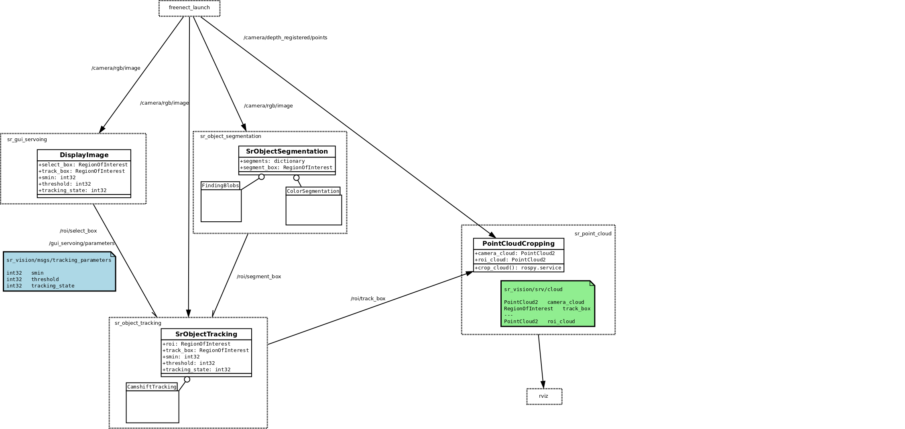

sr_vision
------------

## Overview
Contains our vision related algorithm (segmentation, tracking, recognition, etc...)

  1.  
This package contains the tracker executable. The launch file starts the Kinect as well as the tracking node and the visualization one.
  2. 
Segment the image from the camera in order to find the region of interest.
  3. 
Benchmarking package for the different segmentation algorithms.
  4. 
Visualization package : display the image from the camera, let the user select a region of interest, and display the tracking.
  5. 
This package contains a tracker, a point cloud triangulator, a segmentation tool and a tool to transform point clouds.
  6. 
All messages, services and actions for sr_vision.

You can find the architecture diagram below for a closer look at how this works.

