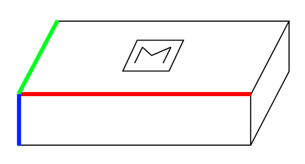
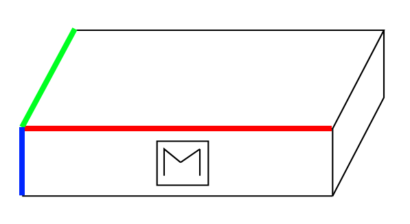
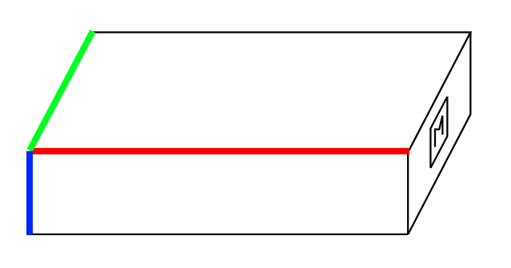

# sr_alvar_object_recognition

This package maps specific ar_track_alvar markers to object frames, allowing object pose estimation based on marker recognition.

## Usage

`alvar_to_object.launch` - launch file that produces object tfs based on the chosen mapping yaml files passed to `map_file` argument.

`alvar_object_recognition` - launch file starting the alvar recognition node and the above mapping node.

In order to run the recognition:
1. Make sure the objects are in the field of view of your camera
2. Run your camera node
3. Depending on your camera, adjust alvar recognition arguments (e.g. different camera have different camera links or you might want to use 3d data for alvar recognition) in the `alvar_object_recognition.launch` file
4. Depending on the scenario, choose the mapping yaml file and pass it to the above launch file. Currenly the defaul is `alvar_to_boxes.yaml` located in the config folder.
4. Start the recognition node
```
roslaunch sr_alvar_object_recognition alvar_object_recognition.launch
```

## Currently available mappings

### Boxes

#### Box sizes

- small: 64x47x26 [mm]
- medium: 165x71x47 [mm]
- large: 154x91x66 [mm]

#### How to put Alvar Markers on the boxes

There are three scenarios for the placement of the boxes:
- scenario A: box is lying flat on the side with largest surface
- scenario B: box is standing on the side with medium surface
- scenario C: box is standing on the side with smallest surface

For each of those scenarios, marker should be placed differently, as in the figures below (scenario A, B and C respectively):

<p float="left" align="center">
  
  &emsp;
  
  &emsp;
  
</p>

In the figures, red denotes the longest edge, green medium edge and blue the shortest edge.

For each of the objects and scenario, different marker should be used:

- small, scenario A: marker 0 or marker 3
- small, scenario B: marker 1 or marker 4
- small, scenario C: marker 2 or marker 5
- medium, scenario A: marker 6 or marker 9
- medium, scenario B: marker 7 or marker 10
- medium, scenario C: marker 8 or marker 11
- large, scenario A: marker 12 or marker 15
- large, scenario B: marker 13 or marker 16
- large, scenario A: marker 14 or marker 17